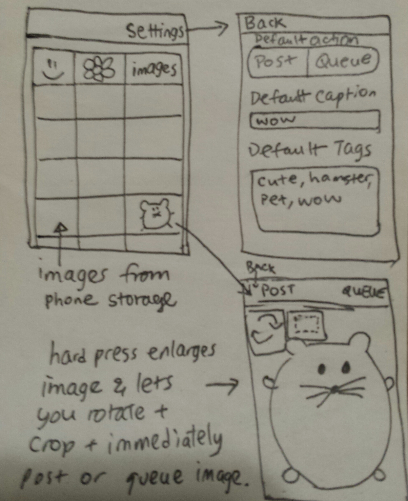

#Tumblr Poster

This is the fastest way to mass post images onto Tumblr from your phone.

Currently, if you want to post an image to Tumblr, you have to:
1. Open the app
2. Click on the + button
3. Click the "Image" type
4. Click "Upload"
5. Wait for your camera images to load
6. Click on image of interest
7. Add captions (if any)
8. Add tags (if any)
9. Press "Post"

This is a lot of clicks. This is especially annoying if you want to queue multiple images, because in addition, you have to:
10. Press the arrow to toggle more options
11. Press "Queue"

For someone who has a themed blog, who posts a LOT of original images onto Tumblr, all with similar tags, this takes a lot of time and effort.

This app will make it very simple to queue and post images from your phone onto Tumblr. The first screen in the app will be a preview of your saved images. Simply tapping on an image will post or queue it (depending on what you have in the settings). In the settings, you can specify which default tags to post with the image. If you hold down on an image, it will take you to another screen where you can rotate or crop that image and then immediately queue/post it when you are done.

##Core Requirements
[ ] Can access phone's photos
[ ] Can log in and out of Tumblr
[ ] Can post and queue posts to Tumblr (either function is set in Settings)
[ ] Can add default tags or captions to posts (set in Settings)
[ ] Can crop and rotate photos and immediately post/queue the photo when done

##Optional Features
[ ] Multi-image upload per post
[ ] Can drag image left to queue, and right to post immediately
[ ] Delete image on upload

##Wireframe

##Demo
I'll be at a conference on the 15th so I'll probably get a teammate to demo, use Hangouts, or pre-record one.
